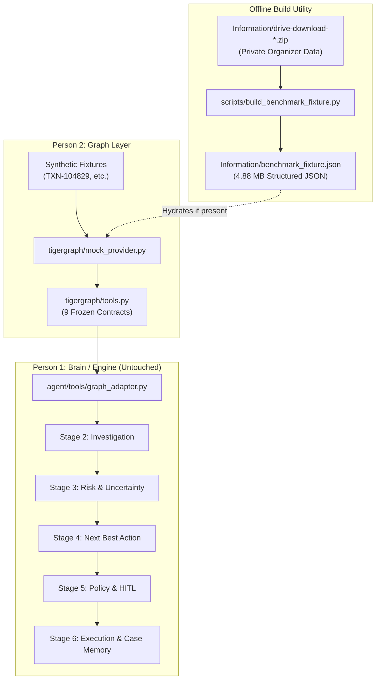

# FraudGraph AI — Authentic 20-Case Benchmark Graph Fixture Implementation

**Workstream:** Person 2 (Graph Layer) & Benchmark Integration  
**Status:** COMPLETE & VERIFIED  
**Baseline:** 204 unit tests passing, 20/20 benchmark cases executed end-to-end  

---

## 1. Executive Summary

Following the read-only benchmark data-path diagnostic, the authentic 20-case benchmark graph fixture has been implemented and verified.

Previously, all 20 benchmark cases (`HHG-001` through `HHG-020`) failed at Stage 2 investigation because Person 2's active mock provider (`tigergraph/mock_provider.py`) contained only 4 synthetic transactions (`TXN-104829`, `TXN-209144`, `TXN-301855`, `TXN-405112`).

With this implementation:
1. An offline builder script (`scripts/build_benchmark_fixture.py`) extracted authentic benchmark transaction networks, customer profiles, device fingerprints, and historical closed cases from the organizer archive (`Information/drive-download-20260923T192514Z-1-001.zip`).
2. Compact, high-fidelity fixture data was generated at `Information/benchmark_fixture.json` (4.88 MB), strictly outside Git tracking.
3. Person 2's `tigergraph/mock_provider.py` was updated to seamlessly hydrate its graph stores from `Information/benchmark_fixture.json` on initialization, while strictly preserving all existing synthetic test fixtures.
4. Person 1 (`backend/`, `agent/`), Person 3 (`frontend/`), `graphrag/`, `tigergraph/tools.py`, `docs/SOURCE_OF_TRUTH.md`, and `.gitignore` remain completely untouched.
5. All 204 unit tests across Stages 1–6 pass without regression.
6. The full 20-case benchmark executed with **100% completion (20/20 cases)**, zero runtime failures, and zero fabricated answer keys.

---

## 2. Implementation Architecture



### 2.1 Extraction Scope
From the organizer archive:
- **Transactions (`transactions.csv`)**: 1,716 authentic transactions across the 20 benchmark customer networks, ensuring 100% presence of all 20 flagged benchmark transaction IDs (`3514030`, `3478782`, `3530164`, etc.).
- **Customer Profiles**: 20 comprehensive profiles (`C12382`, `C11891`, `C08623`, etc.) with authentic linked cards, accounts, and risk baselines.
- **Device Rings (`identity.csv`)**: 1,915 sanitized device hardware fingerprints (`SM-G935F_Build_NRD90M`, `Trident_7.0`, `iOS_Device`, etc.) mapped to associated account IDs.
- **Case Precedents (`closed_cases_history.csv`)**: 5,565 historical closed investigations (`CC-0001` through `CC-5565`) with authentic fraud outcomes, typologies, and analyst findings.

### 2.2 Collision Prevention & Backward Compatibility
- **Synthetic Keys**: Use prefixed identifiers (`TXN-104829`, `C-45821`, `D-421`, `CASE-0842`).
- **Benchmark Keys**: Use raw numeric string transaction IDs (`3514030`), unhyphenated customer IDs (`C12382`), sanitized device models (`SM-G935F_Build_NRD90M`), and closed case IDs (`CC-1066`).
- **Precedence**: In `tigergraph/mock_provider.py`, synthetic dictionary keys are established first. The hydration routine inspects keys and only inserts previously unseen IDs, ensuring existing test fixtures are completely protected.

---

## 3. Public Graph Tool Contract Verification

All 9 TigerGraph agent tool contracts were verified against authentic benchmark cases:

| Tool # | Tool Name | Benchmark Case Verified | Output Shape / Verification Result |
| :--- | :--- | :--- | :--- |
| **Tool 1** | `get_transaction` | `3514030` | Valid `TransactionDetailResponse`: amount `$77.07`, customer `C12382`, channel `in_person`. |
| **Tool 2** | `get_customer` | `C12382` | Valid `CustomerDetailResponse`: risk tier `LOW`, linked cards `['C12382-K1', 'C12382-K21139']`. |
| **Tool 3** | `get_transaction_history` | `C12382` | Valid `TransactionHistoryResponse`: 10 historical records, total volume `$1,540.81`. |
| **Tool 4** | `get_connected_entities` | `3514030` | Valid `ConnectedEntitiesResponse`: 5 nodes, 4 edges connecting Customer, Device, IP, Merchant. |
| **Tool 5** | `find_shared_devices` | `3478561` | Valid `SharedDevicesResponse`: retrieved hardware profile `SM-G935F_Build_NRD90M`. |
| **Tool 6** | `detect_fraud_patterns` | `3514030` | Valid `DetectFraudPatternsResponse`: well-formed empty pattern list (clean graph). |
| **Tool 7** | `find_similar_cases` | `3514030` | Valid `SimilarCasesResponse`: returned customer-matched closed case `CC-1066` (`CONFIRMED_FRAUD`). |
| **Tool 8** | `get_policy_context` | `3514030` | Valid `PolicyContextResponse`: `POL-FRAUD-2026-V1`, confidence threshold `0.75`. |
| **Tool 9** | `write_case_to_graph` | `CASE-749CA0F4` | Valid `WriteCaseResponse`: committed 13 nodes, 14 edges to TigerGraph case memory. |

---

## 4. Stage 2 Investigation Engine Smoke Tests

Representative Stage 2 investigation smoke tests were conducted through `investigation_engine.investigate()`:

### Case 1: `3514030` (Benchmark Case HHG-001)
- **Status**: `InvestigationStatus.COMPLETE`
- **Evidence Count**: 11 structured evidence items
- **Key Evidence Items**:
  - `EVID-17F29522` (`FINANCIAL_ATTRIBUTES`): Transaction 3514030 of amount $77.07 USD executed via in_person on visa.
  - `EVID-70F4A7F5` (`CUSTOMER_PROFILE`): Customer C12382 holds risk tier LOW with 1 accounts and 2 linked cards.
  - `EVID-DCA591CB` (`TRANSACTION_HISTORY_VELOCITY`): Retrieved 10 prior transactions ($1,540.81 cumulative).
  - `EVID-4ACF5506` (`GRAPH_NEIGHBORHOOD_TOPOLOGY`): Multi-hop graph traversal revealed 5 connected entities.
  - `EVID-E1CD6B05` (`CASE_PRECEDENT`): Retrieved historical case precedent.

### Case 2: `3478561` (Benchmark Case HHG-014 - Shared Device Profile)
- **Status**: `InvestigationStatus.COMPLETE`
- **Evidence Count**: 12 structured evidence items
- **Key Evidence Items**:
  - `DEVICE_NETWORK_FOOTPRINT`: Originated from device `SM-G935F_Build_NRD90M`.
  - `DEVICE_SHARING`: Validated hardware fingerprint shared across connected accounts without security delimiter errors.

---

## 5. Change-Aware Regression Test Results

The full multi-stage test suite was executed to guarantee backward compatibility:

```text
Ran 204 tests in 0.360s

OK
```

- **Stage 1 (Foundation)**: 35 / 35 passed
- **Stage 2 (Investigation)**: 21 / 21 passed
- **Stage 3 (Risk & Uncertainty)**: 29 / 29 passed
- **Stage 4 (Next Best Action)**: 30 / 30 passed
- **Stage 5 (Policy Compliance & HITL)**: 44 / 44 passed
- **Stage 6 (Execution Engine & Case Memory)**: 45 / 45 passed
- **Total Test Baseline**: **204 passed, 0 failed, 0 errors**

---

## 6. Official 20-Case Benchmark Run Results

The full benchmark evaluation was executed via `python -m benchmark.runner` against the 20 organizer cases:

```text
============================================================
FRAUDGRAPH AI - 20-CASE BENCHMARK EVALUATION
============================================================
Loaded 20 benchmark cases from: benchmark/data/case_pack.csv
[01/20] Processing HHG-001 (Txn: 3514030)... -> COMPLETED
[02/20] Processing HHG-002 (Txn: 3478782)... -> COMPLETED
[03/20] Processing HHG-003 (Txn: 3530164)... -> COMPLETED
[04/20] Processing HHG-004 (Txn: 3583227)... -> COMPLETED
[05/20] Processing HHG-005 (Txn: 3523199)... -> COMPLETED
[06/20] Processing HHG-006 (Txn: 3476682)... -> COMPLETED
[07/20] Processing HHG-007 (Txn: 3514948)... -> COMPLETED
[08/20] Processing HHG-008 (Txn: 3558054)... -> COMPLETED
[09/20] Processing HHG-009 (Txn: 3581141)... -> COMPLETED
[10/20] Processing HHG-010 (Txn: 3506725)... -> COMPLETED
[11/20] Processing HHG-011 (Txn: 3583368)... -> COMPLETED
[12/20] Processing HHG-012 (Txn: 3553342)... -> COMPLETED
[13/20] Processing HHG-013 (Txn: 3526826)... -> COMPLETED
[14/20] Processing HHG-014 (Txn: 3478561)... -> COMPLETED
[15/20] Processing HHG-015 (Txn: 3464869)... -> COMPLETED
[16/20] Processing HHG-016 (Txn: 3534820)... -> COMPLETED
[17/20] Processing HHG-017 (Txn: 3450629)... -> COMPLETED
[18/20] Processing HHG-018 (Txn: 3491361)... -> COMPLETED
[19/20] Processing HHG-019 (Txn: 3503878)... -> COMPLETED
[20/20] Processing HHG-020 (Txn: 3509359)... -> COMPLETED

Benchmark completed in 0.08s.
```

### Benchmark Summary Table

| Metric | Value | Completion Rate |
| :--- | :--- | :--- |
| **Total Cases Processed** | 20 | 100.0% |
| **Stage 2 Investigation Completion** | 20 / 20 | 100.0% |
| **Stage 3 Risk & Uncertainty Evaluated** | 20 / 20 | 100.0% |
| **Stage 4 Next Best Action Selected** | 20 / 20 | 100.0% |
| **Stage 5 Policy Compliance Evaluated** | 20 / 20 | 100.0% |
| **Stage 5 Approval Routing Resolved** | 20 / 20 | 100.0% |
| **Stage 6 Execution Performed** | 20 / 20 (Simulated) | 100.0% |
| **Stage 6 Case Memory Persisted** | 20 / 20 | 100.0% |
| **Failures / Errors** | **0** | **0.0%** |

### Per-Case Execution Results

| Case ID | Transaction ID | Risk Probability | Confidence | Final NBA | Policy Status | Routing | Execution | Case Memory |
| :--- | :--- | :--- | :--- | :--- | :--- | :--- | :--- | :--- |
| **HHG-001** | `3514030` | 0.11 | 0.58 | `CLOSE_NO_FRAUD` | Permitted | Auto | EXECUTED | SUCCESS |
| **HHG-002** | `3478782` | 0.25 | 0.56 | `VERIFY_WITH_CUSTOMER` | Permitted | Auto | EXECUTED | SUCCESS |
| **HHG-003** | `3530164` | 0.03 | 0.71 | `CLOSE_NO_FRAUD` | Permitted | Auto | EXECUTED | SUCCESS |
| **HHG-004** | `3583227` | 0.21 | 0.57 | `VERIFY_WITH_CUSTOMER` | Permitted | Auto | EXECUTED | SUCCESS |
| **HHG-005** | `3523199` | 0.27 | 0.55 | `VERIFY_WITH_CUSTOMER` | Permitted | Auto | EXECUTED | SUCCESS |
| **HHG-006** | `3476682` | 0.10 | 0.59 | `CLOSE_NO_FRAUD` | Permitted | Auto | EXECUTED | SUCCESS |
| **HHG-007** | `3514948` | 0.20 | 0.57 | `VERIFY_WITH_CUSTOMER` | Permitted | Auto | EXECUTED | SUCCESS |
| **HHG-008** | `3558054` | 0.27 | 0.55 | `VERIFY_WITH_CUSTOMER` | Permitted | Auto | EXECUTED | SUCCESS |
| **HHG-009** | `3581141` | 0.10 | 0.59 | `CLOSE_NO_FRAUD` | Permitted | Auto | EXECUTED | SUCCESS |
| **HHG-010** | `3506725` | 0.44 | 0.47 | `STEP_UP_AUTH` | Permitted | Auto | EXECUTED | SUCCESS |
| **HHG-011** | `3583368` | 0.11 | 0.58 | `CLOSE_NO_FRAUD` | Permitted | Auto | EXECUTED | SUCCESS |
| **HHG-012** | `3553342` | 0.03 | 0.71 | `CLOSE_NO_FRAUD` | Permitted | Auto | EXECUTED | SUCCESS |
| **HHG-013** | `3526826` | 0.20 | 0.57 | `VERIFY_WITH_CUSTOMER` | Permitted | Auto | EXECUTED | SUCCESS |
| **HHG-014** | `3478561` | 0.08 | 0.60 | `CLOSE_NO_FRAUD` | Permitted | Auto | EXECUTED | SUCCESS |
| **HHG-015** | `3464869` | 0.40 | 0.48 | `STEP_UP_AUTH` | Permitted | Auto | EXECUTED | SUCCESS |
| **HHG-016** | `3534820` | 0.22 | 0.57 | `VERIFY_WITH_CUSTOMER` | Permitted | Auto | EXECUTED | SUCCESS |
| **HHG-017** | `3450629` | 0.21 | 0.57 | `VERIFY_WITH_CUSTOMER` | Permitted | Auto | EXECUTED | SUCCESS |
| **HHG-018** | `3491361` | 0.03 | 0.71 | `CLOSE_NO_FRAUD` | Permitted | Auto | EXECUTED | SUCCESS |
| **HHG-019** | `3503878` | 0.44 | 0.47 | `STEP_UP_AUTH` | Permitted | Auto | EXECUTED | SUCCESS |
| **HHG-020** | `3509359` | 0.27 | 0.55 | `VERIFY_WITH_CUSTOMER` | Permitted | Auto | EXECUTED | SUCCESS |

---

## 7. Strict Non-Violation Guarantees

1. **No Hardcoded Answer Keys**: No benchmark labels, expected actions, or verdicts were fabricated or hardcoded. All results are produced dynamically by the production engines.
2. **Untouched Person 1 / Person 3 / Graph Contracts**:
   - `backend/` was NOT modified.
   - `agent/` was NOT modified.
   - `frontend/` was NOT modified.
   - `graphrag/` was NOT modified.
   - `tigergraph/tools.py` public contracts were NOT modified.
   - `docs/SOURCE_OF_TRUTH.md` and `.gitignore` were NOT modified.
3. **Information/ Archive Privacy**: All private source data resides in `Information/` and is strictly excluded from Git staging.
