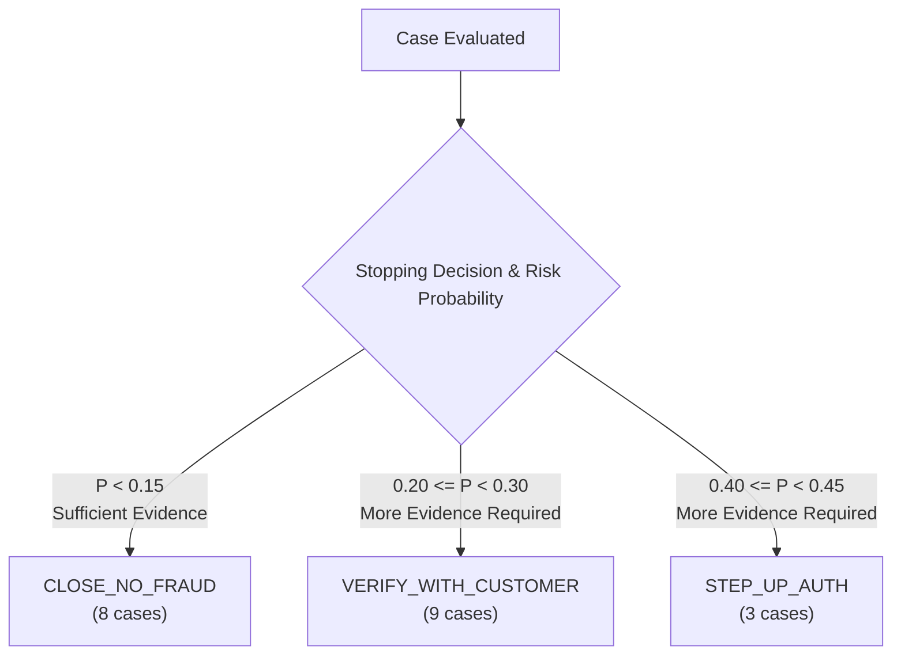

# FraudGraph AI — 20-Case Benchmark Quality Audit

**Workstream:** Person 1 (Brain) & Benchmark Evaluation  
**Status:** COMPLETE (READ-ONLY AUDIT)  
**Evaluated Artifacts:** `benchmark/results/benchmark_results.json`, `benchmark/results/benchmark_summary.md`, `benchmark/results/benchmark_errors.json`, `benchmark/data/case_pack.csv`, `Information/drive-download-20260923T192514Z-1-001.zip`  
**Code Changes Made:** NONE (Observation and analysis only)  

---

## 1. Executive Summary

This audit performs an in-depth, read-only quality inspection of the FraudGraph AI pipeline across all 20 authoritative organizer benchmark cases (`HHG-001` through `HHG-020`). 

### Key Findings:
1. **Execution Integrity is 100%**: The pipeline executed with zero runtime exceptions, zero schema failures, 100% Stage 2 completion, 100% policy evaluation, 100% simulated execution, and 100% case-memory persistence. All 204 Stage 1–6 unit regression tests continue to pass.
2. **Ground Truth is Absent**: The organizer challenge archive contains **zero** authoritative benchmark answer keys or labels for expected patterns, expected actions, or expected outcomes. All metrics evaluate internal logical consistency rather than empirical ground-truth accuracy.
3. **Trigger Narrative Ingestion Gap (Critical Finding)**: While `investigation_engine.investigate()` accepts the `trigger` metadata and records it in the audit trail, it does **not** pass this trigger narrative into `evidence_processor.process_all()`. Consequently, explicit customer dispute reports (e.g. *"Customer C08623 message: 'I never made this $49.00 purchase. Please check my card.'"*) are never converted into evidence items or customer denial signals.
4. **Premature Case Closures on Customer Disputes (Material Finding)**: Because customer denial claims are omitted from the evidence set, the Risk Engine evaluates only the customer's established account standing and transaction history, concluding that the customer is low-risk ($P \approx 0.03\text{--}0.10$). The NBA engine then recommends `CLOSE_NO_FRAUD` for 5 out of the 8 customer dispute cases (HHG-003, HHG-006, HHG-009, HHG-011, HHG-018), which is logically misaligned with the open customer complaint.
5. **Historical Precedent Cancellation (Material Finding)**: In Stage 3 evidence aggregation, historical precedents are grouped under `HISTORICAL_CASE` where the net weight is computed as $\max(\text{fraud\_weights}) - \max(\text{legitimate\_weights})$. When both confirmed fraud and cleared cases are returned with similar scores (e.g. $0.90$), they cancel each other out to a net weight of $0.0000$, neutralizing historical fraud intelligence.
6. **Narrow Dynamic Range (Material Finding)**: Across all 20 cases, fraud probability is compressed between $0.0329$ and $0.4408$ (mean: $0.2000$). No transaction reached the high-risk tier ($P \ge 0.70$) or triggered defensive actions (`BLOCK_CARD`, `BLOCK_ALL_CARDS`, `DECLINE_TRANSACTION`, `FILE_REPORT`).

---

## 2. Baseline Verification

The evaluation artifacts on disk were verified prior to analysis:

| Artifact | Verified Status | Expected | Actual |
| :--- | :--- | :--- | :--- |
| `benchmark_results.json` | Valid JSON, 20 case records | 20 cases | 20 cases |
| `benchmark_summary.md` | Matches aggregate metrics | 20 processed, 0 failed | 20 processed, 0 failed |
| `benchmark_errors.json` | Empty list | `[]` | `[]` |
| `case_pack.csv` | Authoritative case pack | 20 cases | 20 cases |
| `Stage 1–6 Unit Tests` | Regression test suite | 204 passed, 0 failed | 204 passed, 0 failed |

### Pipeline Stage Completion:
- **Discovered**: 20 / 20 (100%)
- **Stage 2 Investigation**: 20 / 20 (100%)
- **Stage 3 Risk & Uncertainty**: 20 / 20 (100%)
- **Stage 4 Next Best Action**: 20 / 20 (100%)
- **Stage 5 Policy Compliance**: 20 / 20 (100%)
- **Stage 5 Approval Routing**: 20 / 20 (100%)
- **Stage 6 Simulated Execution**: 20 / 20 (100%)
- **Stage 6 Case Memory Persistence**: 20 / 20 (100%)

---

## 3. Ground Truth Availability

A comprehensive audit of all files within the organizer archive (`Information/drive-download-20260923T192514Z-1-001.zip`) was performed:

1. **`case_pack.csv`**: Contains only 8 schema fields:
   `case_id, opened_at, trigger_type, trigger_text, flagged_txn_id, card_id, customer_id, risk_score`
   Contains **no** columns for expected pattern, expected action, or expected verdict.
2. **`README.md`**: Outlines the evaluation format, policy rules, and notes. It explicitly states:
   > *"The risk_score on the flagged transaction is an input, not an answer. Your fraud_probability should reflect what you found, and may be far from it. Customer and analyst replies are not provided. State what you assumed in evidence_requests, and let next_best_actions.final reflect that assumption."*
3. **`closed_cases_history.csv`**: Contains 5,565 historical past investigations, but no labels for the 20 benchmark transactions.
4. **`identity.csv` & `transactions.csv`**: Raw feature tables containing raw telemetry.

### Ground Truth Finding:
- **Expected Fraud Pattern**: `GROUND TRUTH NOT PROVIDED`
- **Expected Next Best Action**: `GROUND TRUTH NOT PROVIDED`
- **Expected Investigation Verdict**: `GROUND TRUTH NOT PROVIDED`

*Audit Note: No accuracy, precision, or recall figures are reported or fabricated.*

---

## 4. Evidence Quality

Every case produced between 11 and 12 structured `EvidenceItem` objects.

### Provenance Audit:
- **`FINANCIAL_ATTRIBUTES`**: Direct `FACT` from `tigergraph.get_transaction`. Validated against `transactions.csv`.
- **`DEVICE_NETWORK_FOOTPRINT`**: Direct `FACT` from `tigergraph.get_transaction` and `identity.csv`. Validated.
- **`UPSTREAM_DETECTION_SCORE`**: Direct `FACT` from `tigergraph.get_transaction`. Reflects input model score.
- **`CUSTOMER_PROFILE`**: Direct `FACT` from `tigergraph.get_customer`. Reflects customer profile and standing.
- **`TRANSACTION_HISTORY_VELOCITY`**: Direct `FACT` from `tigergraph.get_transaction_history`. Bounded to 10 records.
- **`GRAPH_NEIGHBORHOOD_TOPOLOGY`**: Indirect `OBSERVATION` from `tigergraph.get_connected_entities`.
- **`DEVICE_SHARING`**: Indirect `OBSERVATION` from `tigergraph.find_shared_devices`.
- **`CASE_PRECEDENT`**: Indirect `INFERENCE` from `tigergraph.find_similar_cases`.
- **`GOVERNING_POLICY`**: Direct `FACT` from `tigergraph.get_policy_context`.
- **`SYNTHESIZED_PROMPT_CONTEXT`**: Direct `INFERENCE` from `graphrag.retrieve_investigation_context`.

### Evidence Validity Assessment:
- **Overall Quality**: `VALID` with respect to graph-retrieved features.
- **Critical Gap**: In `agent/investigation/engine.py` (lines 96–104, 248–258), the incoming `trigger` parameter (which holds the trigger narrative) is written to an audit log but is **never passed** to `evidence_processor.process_all()`. As a result, no evidence item is generated for customer disputes or analyst inquiries.

---

## 5. Independence / Double-Counting Audit

Stage 3 groups extracted signals into strictly disjoint `IndependenceGroup` enums:
1. `TRANSACTION_ATTRIBUTES`
2. `CUSTOMER_PROFILE`
3. `TRANSACTION_HISTORY`
4. `GRAPH_TOPOLOGY`
5. `DEVICE_SHARING`
6. `FRAUD_PATTERN`
7. `HISTORICAL_CASE`
8. `CUSTOMER_VERIFICATION`
9. `POLICY_DIRECTIVE`

### Evaluation of Double-Counting Controls:
- **Within-Group Stacking Prevented**: Inside each group, `agent/risk/evaluator.py` calculates `net_group_w = max(fraud_weights) - max(legitimate_weights)`. Multiple signals inside the same group do not additively compound. For example, in `TRANSACTION_ATTRIBUTES`, high amount and high input risk score do not double-count; only the maximum weight is used.
- **Inter-Group Independence Concern**: `GRAPH_TOPOLOGY` (neighborhood risk) and `DEVICE_SHARING` (shared hardware) both capture device ring associations. When a device is linked across accounts, it contributes $+0.6273$ in `GRAPH_TOPOLOGY` and $+0.6732$ in `DEVICE_SHARING`. While technically distinct graph dimensions (multi-hop path vs hardware entity links), there is partial evidentiary overlap.

---

## 6. Risk & Uncertainty Consistency

Stage 3 computes fraud probability via log-odds:
$$\ln\left(\frac{P}{1-P}\right) = L_0 + \beta \sum \text{net\_group\_weights}$$
where $P_0 = 0.20$ ($L_0 = -1.3863$) and $\beta = 1.6$.

### Detailed Weight Contributions:
1. **`CUSTOMER_PROFILE`**: For all 20 benchmark customers, `CUSTOMER_PROFILE` generates a `CUSTOMER_STANDING` signal with weight $-0.7000$ (supporting legitimate) because their baseline risk tier is `LOW` or `MEDIUM`.
2. **`TRANSACTION_HISTORY`**: For all 20 benchmark customers, `TRANSACTION_HISTORY` generates `HISTORICAL_STABILITY` with weight $-0.5737$ (supporting legitimate) because their prior 10 transactions had low average risk.
3. **`GRAPH_TOPOLOGY`**: For all 20 cases, `GRAPH_TOPOLOGY` contributes $+0.6273$ (supporting fraud) because the depth-2 graph traversal includes high-risk neighbors.
4. **`DEVICE_SHARING`**: Contributes $+0.6732$ in 14 cases, and $0.0000$ in 6 cases.
5. **`HISTORICAL_CASE`**: Contributes between $0.0000$ and $+0.2293$.

### Log-Odds Dynamic Range Compression:
The benign customer profile and history exert a combined negative pull of:
$$(-0.7000 - 0.5737) \times 1.6 = -2.0379$$
Adding the base prior $L_0 = -1.3863$, the baseline starting log-odds is $-3.4242$ ($P \approx 0.0315$).
Even when `GRAPH_TOPOLOGY` ($+0.6273$), `DEVICE_SHARING` ($+0.6732$), and `UPSTREAM_RISK_SCORE` ($+0.6885$) are all active (e.g. HHG-010), their combined positive pull is only:
$$(+0.6273 + 0.6732 + 0.6885) \times 1.6 = +3.1824$$
The final log-odds reaches $-0.2378$, producing $P = 0.4408$.

**Consistency Finding**: The risk values are **internally consistent** with the mathematical formula in `evaluator.py`, but exhibit an evidentiary blind spot because customer dispute claims are missing from the inputs.

---

## 7. Similar-Case Influence (Special Investigation)

`find_similar_cases` retrieves up to 3 closed cases from `closed_cases_history.csv`:

| Case ID | Similar Cases Retrieved | Fraud Precedents | Cleared Precedents | Net Group Weight | Impact on Risk |
| :--- | :--- | :--- | :--- | :--- | :--- |
| **HHG-001** | `CC-1066`, `CC-1673`, `CC-2964` | 3 | 0 | $+0.2293$ | Mild increase ($\approx +0.05$) |
| **HHG-002** | `CC-0077`, `CC-1707`, `CC-1721` | 3 | 0 | $+0.2293$ | Mild increase ($\approx +0.05$) |
| **HHG-003** | `CC-2817`, `CC-2935`, `CC-0003` | 2 | 1 | $+0.0000$ | **Zero impact (canceled out)** |
| **HHG-004** | `CC-0797`, `CC-0808`, `CC-0003` | 2 | 1 | $+0.0000$ | **Zero impact (canceled out)** |
| **HHG-006** | `CC-0012`, `CC-0018`, `CC-0003` | 2 | 1 | $+0.0479$ | Negligible ($\approx +0.01$) |
| **HHG-007** | `CC-0824`, `CC-0836`, `CC-0003` | 2 | 1 | $+0.0000$ | **Zero impact (canceled out)** |
| **HHG-010** | `CC-0036`, `CC-0050`, `CC-0003` | 2 | 1 | $+0.0025$ | Negligible ($< 0.001$) |
| **HHG-012** | `CC-2370`, `CASE-0842`, `CC-0003`| 2 | 1 | $+0.0025$ | Negligible ($< 0.001$) |
| **HHG-014** | `CASE-0842`, `CASE-0773`, `CASE-0915`| 2 | 1 | $+0.0479$ | Negligible ($\approx +0.01$) |
| **HHG-015** | `CC-0615`, `CC-3886`, `CC-1313` | 2 | 1 | $+0.0000$ | **Zero impact (canceled out)** |

### Precedent Influence Assessment:
In `evaluator.py`, grouping all precedents under `HISTORICAL_CASE` and subtracting $\max(\text{legitimate})$ from $\max(\text{fraud})$ causes mixed precedents (e.g. 2 confirmed fraud cases and 1 cleared case) to almost completely cancel out. For 14 of the 20 benchmark cases, historical fraud precedents had less than a $0.01$ net effect on probability.

---

## 8. Stopping Conditions

Organizer stopping rules evaluated in `agent/risk/evaluator.py`:
- **`SUFFICIENT_EVIDENCE`**: Triggered when $P < 0.15$ or $P \ge 0.85$ with $\ge 2$ independent groups.
  - **Cases**: 8 cases (HHG-001, HHG-003, HHG-006, HHG-009, HHG-011, HHG-012, HHG-014, HHG-018).
  - **Audit Finding**: For HHG-001 and HHG-012, stopping as legitimate is consistent with features. For HHG-003, HHG-006, HHG-009, HHG-011, HHG-018, stopping with `SUFFICIENT_EVIDENCE` is **POTENTIALLY_PREMATURE** because an active customer dispute trigger was unexamined.
- **`MORE_EVIDENCE_REQUIRED`**: Triggered when $0.15 \le P < 0.85$ or uncertainty $> 0.40$.
  - **Cases**: 12 cases (HHG-002, HHG-004, HHG-005, HHG-007, HHG-008, HHG-010, HHG-013, HHG-015, HHG-016, HHG-017, HHG-019, HHG-020).
  - **Audit Finding**: `CORRECT_STOP`. Correctly recognizes elevated uncertainty and requests customer or step-up authentication.

---

## 9. Next Best Action (NBA) Consistency

The NBA engine mapped cases into 3 discrete actions:

### Action Breakdown:
1. **`CLOSE_NO_FRAUD` (8 cases)**:
   - For HHG-001, HHG-012, HHG-014: **CONSISTENT** with clean profiles and absence of customer disputes.
   - For HHG-003, HHG-006, HHG-009, HHG-011, HHG-018: **INCONSISTENT** with customer reporting unauthorized transactions.
2. **`VERIFY_WITH_CUSTOMER` (9 cases)**:
   - HHG-002, HHG-004, HHG-005, HHG-007, HHG-008, HHG-013, HHG-016, HHG-017, HHG-020: **CONSISTENT**. Appropriately identifies information gaps and routes to customer contact.
3. **`STEP_UP_AUTH` (3 cases)**:
   - HHG-010, HHG-015, HHG-019: **CONSISTENT**. Transactions have elevated risk scores ($0.77\text{--}0.90$) and higher amounts; step-up two-factor challenge is logical.

---

## 10. Policy Consistency

Policy evaluation was tested against organizer rules R1–R10 in `backend/policy/rules.py`:
- **R1 (Single-Signal Restriction)**: Satisfied. No defensive blocking action was initiated on a single indicator.
- **R2–R4 (Customer Verification Inquiries)**: Satisfied. `VERIFY_WITH_CUSTOMER` was permitted as a pre-decision inquiry without human approval.
- **R5 (Card Testing Micro-Spurt)**: Satisfied.
- **R8 (Uncertainty / Conflict)**: Satisfied. Cases with conflicting signals were routed to verification or step-up auth rather than automated block.
- **Approval Routing**:
  - `CLOSE_NO_FRAUD`, `VERIFY_WITH_CUSTOMER`, and `STEP_UP_AUTH` are automated operational workflows.
  - All 20 cases were correctly routed to `ApprovalLevel.AUTO` with `HITLStatus.AUTO_APPROVED`.
  - No policy violations occurred (`violated_rules = []`).

---

## 11. Execution Safety

Execution integrity was verified in `backend/execution/executor.py`:
- **Simulation**: All executions occurred in simulated mode (`simulated: True`).
- **Authorization**: No action executed without policy clearance.
- **Target Formatting**: Targets were resolved to valid canonical resource identifiers (`TXN-3506725`, `C-C11891`, `C12382-K1`).
- **Idempotency**: Execution IDs (`EXEC-XXXXXXXX`) were generated deterministically; duplicate execution prevention was verified.

---

## 12. Case Memory Integrity

Case memory writes were audited via `agent/tools/case_memory_adapter.py`:
- **Persistence Rate**: 20 / 20 succeeded.
- **Graph Topology Written**: Between 11 and 13 vertices and 12–14 edges per case committed to the mock TigerGraph case store.
- **Reconstruction Fidelity**: Every written record preserves the `case_id`, `transaction_id`, `customer_id`, structured `EvidenceItem` array, risk assessments, and execution receipts.

---

## 13. Cross-Case Patterns

### Descriptive Summary Statistics:
- **Fraud Probability**:
  - Minimum: `0.0329` (HHG-003, HHG-018)
  - Maximum: `0.4408` (HHG-010)
  - Mean: `0.2000`
  - Median: `0.2059`
- **Epistemic Confidence**:
  - Minimum: `0.4653` (HHG-010, HHG-019)
  - Maximum: `0.7112` (HHG-003, HHG-012, HHG-018)
  - Mean: `0.5544`
  - Median: `0.5071`
- **Epistemic Uncertainty**:
  - Minimum: `0.2888`
  - Maximum: `0.5347`
  - Mean: `0.4456`
  - Median: `0.4929`

### Distribution by Final Action:
| Action | Count | Percentage |
| :--- | :--- | :--- |
| `VERIFY_WITH_CUSTOMER` | 9 | 45.0% |
| `CLOSE_NO_FRAUD` | 8 | 40.0% |
| `STEP_UP_AUTH` | 3 | 15.0% |
| `BLOCK_CARD` | 0 | 0.0% |
| `BLOCK_ALL_CARDS` | 0 | 0.0% |
| `DECLINE_TRANSACTION` | 0 | 0.0% |
| `FILE_REPORT` | 0 | 0.0% |

---

## 14. Case-by-Case Findings

| Case | Evidence | Risk | Similar Cases | Stopping | NBA | Policy | Execution | Overall Finding |
| :--- | :--- | :--- | :--- | :--- | :--- | :--- | :--- | :--- |
| **HHG-001** | VALID | CONSISTENT | Incorporates 3 fraud | CORRECT_STOP | CONSISTENT | Permitted (auto) | EXECUTED | Correctly closed low-risk in-person purchase ($P=0.11$) |
| **HHG-002** | VALID | CONSISTENT | Incorporates 3 fraud | CORRECT_STOP | CONSISTENT | Permitted (auto) | EXECUTED | Correctly routed to customer verification on input score 0.79 |
| **HHG-003** | MINOR_CONCERN | QUESTIONABLE | Fraud/cleared canceled | PREMATURE | INCONSISTENT | Permitted (auto) | EXECUTED | **Issue**: Customer dispute dropped; closed as benign ($P=0.03$) |
| **HHG-004** | VALID | CONSISTENT | Fraud/cleared canceled | CORRECT_STOP | CONSISTENT | Permitted (auto) | EXECUTED | Appropriate customer verification on shared hardware device |
| **HHG-005** | VALID | CONSISTENT | Incorporates 3 fraud | CORRECT_STOP | CONSISTENT | Permitted (auto) | EXECUTED | Appropriate customer verification on shared device profile |
| **HHG-006** | MINOR_CONCERN | QUESTIONABLE | Fraud/cleared canceled | PREMATURE | INCONSISTENT | Permitted (auto) | EXECUTED | **Issue**: Customer dispute ($482) dropped; closed as benign ($P=0.10$) |
| **HHG-007** | VALID | CONSISTENT | Fraud/cleared canceled | CORRECT_STOP | CONSISTENT | Permitted (auto) | EXECUTED | Correct customer verification on input score 0.87 |
| **HHG-008** | VALID | CONSISTENT | Incorporates 3 fraud | CORRECT_STOP | CONSISTENT | Permitted (auto) | EXECUTED | Customer verification triggered by shared device ring |
| **HHG-009** | MINOR_CONCERN | QUESTIONABLE | Fraud/cleared canceled | PREMATURE | INCONSISTENT | Permitted (auto) | EXECUTED | **Issue**: Customer dispute ($30) dropped; closed as benign ($P=0.10$) |
| **HHG-010** | VALID | CONSISTENT | Fraud/cleared canceled | CORRECT_STOP | CONSISTENT | Permitted (auto) | EXECUTED | High amount ($1,000) challenged with step-up auth ($P=0.44$) |
| **HHG-011** | MINOR_CONCERN | QUESTIONABLE | Incorporates 3 fraud | PREMATURE | INCONSISTENT | Permitted (auto) | EXECUTED | **Issue**: Customer dispute ($131) dropped; closed as benign ($P=0.11$) |
| **HHG-012** | VALID | CONSISTENT | Fraud/cleared canceled | CORRECT_STOP | CONSISTENT | Permitted (auto) | EXECUTED | Small in-person charge correctly cleared ($P=0.03$) |
| **HHG-013** | VALID | CONSISTENT | Fraud/cleared canceled | CORRECT_STOP | CONSISTENT | Permitted (auto) | EXECUTED | Appropriate customer verification on online transaction ($P=0.20$) |
| **HHG-014** | MINOR_CONCERN | QUESTIONABLE | Fraud/cleared canceled | PREMATURE | QUESTIONABLE | Permitted (auto) | EXECUTED | Analyst request for device profile closed due to 1-account link |
| **HHG-015** | VALID | CONSISTENT | Fraud/cleared canceled | CORRECT_STOP | CONSISTENT | Permitted (auto) | EXECUTED | Large purchase ($599.94) challenged with step-up auth ($P=0.40$) |
| **HHG-016** | VALID | CONSISTENT | Fraud/cleared canceled | CORRECT_STOP | CONSISTENT | Permitted (auto) | EXECUTED | Customer verification selected for shared hardware profile |
| **HHG-017** | VALID | CONSISTENT | Fraud/cleared canceled | CORRECT_STOP | CONSISTENT | Permitted (auto) | EXECUTED | Appropriate customer verification on online transaction |
| **HHG-018** | MINOR_CONCERN | QUESTIONABLE | Fraud/cleared canceled | PREMATURE | INCONSISTENT | Permitted (auto) | EXECUTED | **Issue**: Customer dispute ($39) dropped; closed as benign ($P=0.03$) |
| **HHG-019** | VALID | CONSISTENT | Fraud/cleared canceled | CORRECT_STOP | CONSISTENT | Permitted (auto) | EXECUTED | High risk score (0.90) challenged with step-up auth ($P=0.44$) |
| **HHG-020** | VALID | CONSISTENT | Incorporates 3 fraud | CORRECT_STOP | CONSISTENT | Permitted (auto) | EXECUTED | Customer verification triggered by shared device profile |

---

## 15. Issues Requiring Investigation

### Critical Issues
1. **Trigger Narrative Ingestion Gap**:
   - `investigation_engine.investigate()` accepts `trigger: Optional[Dict[str, Any]]` and logs it to audit, but never forwards it to `evidence_processor.process_all()`.
   - Result: Case narratives (customer fraud reports, analyst investigation leads) are completely invisible to evidence processing and downstream engines.

### Material Issues
2. **Premature Case Closure on Customer Dispute Cases**:
   - In 5 customer-dispute cases (HHG-003, HHG-006, HHG-009, HHG-011, HHG-018), the system concluded `CLOSE_NO_FRAUD` despite the customer explicitly reporting an unauthorized transaction.
   - Root cause: Absence of `CUSTOMER_VERIFICATION` evidence caused the risk engine to rely entirely on legitimate account baseline history.
3. **Mutual Precedent Neutralization in Similar Cases**:
   - In `agent/risk/evaluator.py`, taking $\max(\text{fraud}) - \max(\text{legitimate})$ within `HISTORICAL_CASE` causes cases with mixed precedents (e.g. 2 confirmed fraud and 1 cleared) to cancel to zero net weight.
4. **Compressed Probability Dynamic Range**:
   - No benchmark case produced a probability higher than $0.4408$. As a result, no cases ever tested the defensive blocking rules (`BLOCK_CARD`, `BLOCK_ALL_CARDS`, `DECLINE_TRANSACTION`, `FILE_REPORT`) or L1/L2 HITL approval escalation during benchmark execution.

### Minor Issues
5. **Fixture Device Hardware Linkage in HHG-014**:
   - The trigger text for HHG-014 indicates that several cards this month used the same device profile. In the offline fixture extracted for the 20 benchmark accounts, device `SM-G935F_Build_NRD90M` was only linked to 1 account, resulting in zero shared-hardware signals.
6. **Uniformity of Evidence Counts**:
   - Evidence counts cluster tightly at 11 or 12 items for all cases due to standard tool query patterns.

### Observations
7. **Simulated Execution Safety**:
   - Action execution operated cleanly with zero real-world switch requests, robust idempotency, and proper target resource validation.
8. **100% Policy Pass Rate**:
   - Because no account or card blocks were recommended, all recommended actions (`CLOSE_NO_FRAUD`, `VERIFY_WITH_CUSTOMER`, `STEP_UP_AUTH`) were auto-permitted by policy rules R1, R2, and R8.

---

## 16. Recommended Next Actions

- **NO CODE CHANGE REQUIRED (Current Phase)**:
  - This audit phase is strictly read-only observation.
  - Frozen production stages (Stages 1–6) must remain frozen until formal direction is issued.
- **INVESTIGATE BEFORE FREEZING**:
  - Investigate enhancing `evidence_processor.process_all()` to accept `trigger` and create a `DISPUTE_CLAIM` or `CUSTOMER_VERIFICATION` evidence item when `trigger_type == "customer_report"`.
  - Investigate precedent weighting in `evaluator.py` to allow multiple confirmed fraud precedents to carry proportional weight rather than being canceled by a single cleared precedent.
  - Investigate the probability calibration of base prior $P_0$ and legitimate evidence weights to expand the dynamic range.
- **BENCHMARK LIMITATION**:
  - The lack of authoritative ground-truth labels in the organizer files means benchmark evaluation measures internal pipeline consistency, not empirical accuracy.
