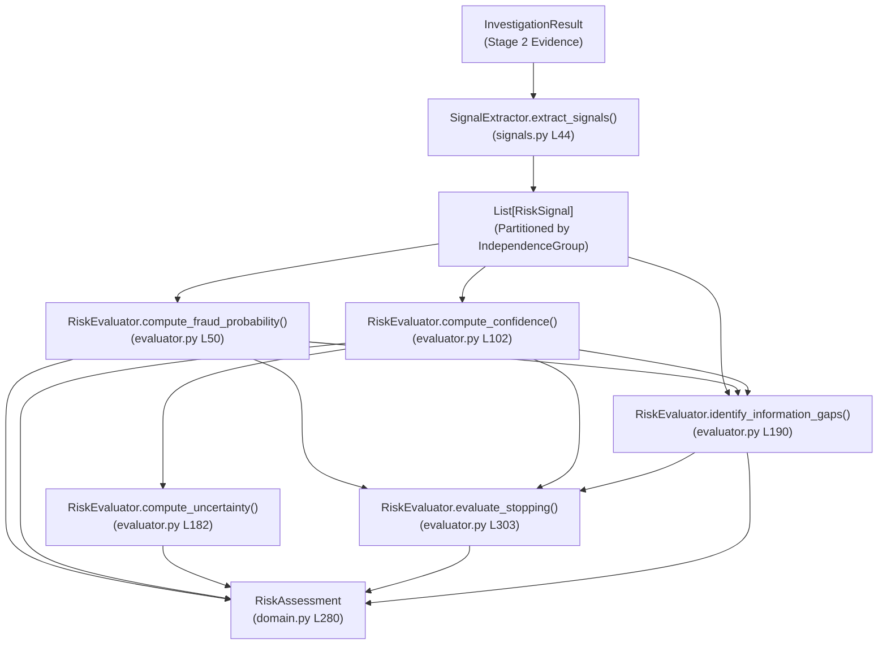

# FraudGraph AI — Stage 3 Read-Only Reasoning Audit
## Historical Precedent & Probability Aggregation

**Workstream:** Person 1 (Brain) — Stage 3 Risk + Uncertainty Engine  
**Audit Type:** READ-ONLY ARCHITECTURAL & MATHEMATICAL AUDIT  
**Status:** COMPLETE  
**Code Changes Made:** NONE (`FILES_MODIFIED: NONE`)  
**Evaluated Artifacts:**
- `agent/risk/signals.py`
- `agent/risk/evaluator.py`
- `agent/risk/service.py`
- `backend/models/domain.py`
- `benchmark/results/benchmark_results.json`
- `benchmark/results/trigger_evidence_fix_report.md`
- `benchmark/results/benchmark_summary.md`
- `tests/test_stage3_risk.py`

---

## 1. Executive Summary

This read-only audit evaluates the Stage 3 Risk and Uncertainty reasoning engine of FraudGraph AI following the Stage 2 trigger-evidence ingestion fix.

### Overall Assessment:
**Stage 3 reasoning is structurally sound with two identified mathematical weaknesses and one confirmed defect.**

1. **Logical and Architectural Soundness**:
   - **Strict Boundary Integrity**: Stage 3 consumes only the structured `InvestigationResult` produced by Stage 2. It performs zero external re-querying of TigerGraph or GraphRAG, makes no calls to Stage 4 NBA or Stage 5 Policy, and enforces clean separation between risk assessment, action recommendations, and policy gating.
   - **Epistemic Distinction**: Epistemic confidence ($C \in [0.05, 0.98]$) and uncertainty ($U = 1.0 - C$) are mathematically decoupled from fraud probability ($P \in [0.01, 0.99]$). Confidence correctly measures evidential corroboration, contradiction, and completeness rather than risk magnitude.
   - **Monotonic Log-Odds Aggregation**: The log-odds Bayesian-inspired aggregation formula guarantees bounded probabilities $[0.01, 0.99]$, non-domination by single upstream scores, and monotonic sensitivity to independent evidence streams.
2. **Confirmed Defect — Precedent Neutralization**:
   - Within `IndependenceGroup.HISTORICAL_CASE`, taking $\max(\text{fraud\_weights}) - \max(\text{legit\_weights})$ causes analogous historical cases with mixed outcomes to mutually cancel to **zero net weight**. In the 20-case benchmark, **14 out of 20 cases (70%)** have their historical precedents silenced ($\le 0.0479$), and in **7 cases (35%)**, a 2-to-1 majority of 90% confirmed fraud precedents is completely wiped out to $+0.0000$ by a single cleared precedent.
3. **Identified Weaknesses**:
   - **Precedent Over-Dampening**: Historical cases retrieved from `closed_cases_history.csv` are subjected to four compounding reduction factors ($0.80$ similarity cap $\times 0.70$ `INFERENCE` $\times 0.90$ indirect $\times 0.50$ `is_untrusted=True`), yielding an effective weight ceiling of only $0.2293$ ($\Delta L = +0.3669$), severely under-weighting past case intelligence relative to customer tenure.
   - **Heavy Legitimate Anchor**: Every benchmark customer possesses a `LOW` risk tier ($-0.7000$) and $\ge 5$ clean historical transactions ($-0.5737$), creating a combined baseline anchor of $-3.4242$ in log-odds ($P \approx 0.0315$). In low-dollar disputes (HHG-003, HHG-018), this legitimate anchor keeps $P = 0.1403$, just below the $0.1500$ closure threshold despite explicit customer fraud denial.
   - **Stopping Rule 2 Premature Settling**: In `evaluator.py`, any `CUSTOMER_VERIFICATION` signal automatically triggers `SUFFICIENT_EVIDENCE` (`VERIFICATION_SETTLED`), treating an unverified inbound customer dispute observation identically to a completed, confirmed two-way verification inquiry.

---

## 2. Establish Current Baseline

### 2.1 Current Stage 3 Pipeline
The Stage 3 reasoning service operates as a sequential, feed-forward pipeline inside [`agent/risk/service.py`](file:///c:/Users/prath/Drive/FraudDetection/agent/risk/service.py):



### 2.2 Domain Schema & Signal Model
Inside [`backend/models/domain.py`](file:///c:/Users/prath/Drive/FraudDetection/backend/models/domain.py) (lines 262–278), `RiskSignal` represents an atomic evidentiary finding:

```python
class RiskSignal(BaseModel):
    signal_id: str
    category: str
    description: str
    direction: SignalDirection  # SUPPORTS_FRAUD, SUPPORTS_LEGITIMATE, NEUTRAL
    strength: float            # Inherent raw strength in [0.0, 1.0]
    weight: float              # Quality-adjusted effective weight in [0.05, 1.0]
    source: str
    evidence_ids: List[str]
    provenance: List[str]
    independence_group: IndependenceGroup
```

### 2.3 Independence Groups
`IndependenceGroup` ([`backend/models/domain.py`](file:///c:/Users/prath/Drive/FraudDetection/backend/models/domain.py) line 241) partitions evidence into strictly disjoint categories to prevent double-counting:
1. `TRANSACTION_ATTRIBUTES`: Amount scale, channel, raw upstream risk score.
2. `CUSTOMER_PROFILE`: Customer risk tier, account tenure, linked cards.
3. `TRANSACTION_HISTORY`: Velocity baseline, 30-day historical stability vs anomalies.
4. `GRAPH_TOPOLOGY`: Multi-hop neighborhood risk, high-risk entity density.
5. `DEVICE_SHARING`: Hardware fingerprint overlap, account-to-device ratio.
6. `FRAUD_PATTERN`: Graph-detected algorithmic fraud typologies (FP-01 to FP-05).
7. `HISTORICAL_CASE`: Closed precedent similarity and outcome from GraphRAG/TigerGraph.
8. `CUSTOMER_VERIFICATION`: Inbound dispute claims, cardholder verification responses.
9. `POLICY_DIRECTIVE`: Governing regulatory or bank policy context (strictly neutral).

### 2.4 Evidence Quality Multipliers & Weight Formula
In [`agent/risk/signals.py`](file:///c:/Users/prath/Drive/FraudDetection/agent/risk/signals.py) (lines 35–39, 406–421), effective signal weight is computed via `_compute_effective_weight`:

$$\text{weight} = \text{round}\Big(\max\big(0.05, \min(1.0, \text{strength} \times \mu_{\text{fact}} \times \mu_{\text{direct}} \times \mu_{\text{untrusted}})\big), 4\Big)$$

Where:
- $\mu_{\text{fact}}$: `FACT` = $1.0$, `OBSERVATION` = $0.85$, `INFERENCE` = $0.70$
- $\mu_{\text{direct}}$: `is_direct=True` = $1.0$, `is_direct=False` = $0.90$
- $\mu_{\text{untrusted}}$: `is_untrusted=True` = $0.50$, `is_untrusted=False` = $1.0$

### 2.5 Probability Aggregation Formula
In [`agent/risk/evaluator.py`](file:///c:/Users/prath/Drive/FraudDetection/agent/risk/evaluator.py) (lines 41–90):

1. **Base Prior**:
   $$P_0 = 0.20 \implies L_0 = \ln\left(\frac{P_0}{1 - P_0}\right) = \ln\left(\frac{0.20}{0.80}\right) = -1.3863$$
   *(Clamped to $[0.05, 0.50]$ if user-specified).*
2. **Evidence Scaling Factor**: $\beta = 1.6$.
3. **Intra-Group Dominance (Double-Counting Prevention)**:
   For each active group $g \in G$:
   $$w_{\text{fraud}, g} = \max\Big(\{s.\text{weight} \mid s \in g, s.\text{direction} = \text{SUPPORTS\_FRAUD}\} \cup \{0.0\}\Big)$$
   $$w_{\text{legit}, g} = \max\Big(\{s.\text{weight} \mid s \in g, s.\text{direction} = \text{SUPPORTS\_LEGITIMATE}\} \cup \{0.0\}\Big)$$
   $$\text{net\_group\_w}_g = w_{\text{fraud}, g} - w_{\text{legit}, g}$$
4. **Log-Odds Aggregation**:
   $$L_{\text{final}} = L_0 + \beta \sum_{g \in G} \text{net\_group\_w}_g = -1.3863 + 1.6 \sum_{g \in G} \text{net\_group\_w}_g$$
5. **Sigmoid Mapping & Bounds**:
   $$P_{\text{raw}} = \sigma(L_{\text{final}}) = \frac{1}{1 + e^{-L_{\text{final}}}}$$
   $$P = \text{round}\Big(\max(0.01, \min(0.99, P_{\text{raw}})), 4\Big)$$

### 2.6 Confidence & Uncertainty Formulation
In [`agent/risk/evaluator.py`](file:///c:/Users/prath/Drive/FraudDetection/agent/risk/evaluator.py) (lines 102–189):
- **Direction**: `is_fraud_dominant = P >= 0.50`.
- **Corroborating Groups Count ($k_{\text{supp}}$)**: Number of independent groups with $|\text{net\_group\_w}| > 0.10$ aligned with prevailing direction.
- **Base Confidence ($C_0$)**:
  $$C_0 = \begin{cases} 0.25 & k_{\text{supp}} = 0 \\ 0.48 & k_{\text{supp}} = 1 \quad (\text{Single source cap: } 0.50) \\ 0.75 & k_{\text{supp}} = 2 \quad (\ge 2 \text{ sources threshold}) \\ 0.86 & k_{\text{supp}} = 3 \\ 0.94 & k_{\text{supp}} \ge 4 \end{cases}$$
- **Quality Bonus**: $C_1 = C_0 \times (0.85 + 0.15 \times \bar{w}_{\text{supp}})$.
- **Contradiction Penalty**:
  $$\text{penalty} = \min\left(0.30, 0.40 \times \frac{W_{\text{opp}}}{W_{\text{supp}} + W_{\text{opp}}}\right) \implies C_2 = C_1 - \text{penalty}$$
- **Outage Penalty**: If `status == PARTIAL` or warnings exist, $C_3 = C_2 - 0.15$. If `FAILED`, $C_3 = 0.10$.
- **Final Confidence & Uncertainty**:
  $$C = \text{round}\Big(\max(0.05, \min(0.98, C_3)), 4\Big)$$
  $$U = \text{round}(1.0 - C, 4)$$

### 2.7 Stopping-Condition Logic
In [`agent/risk/evaluator.py`](file:///c:/Users/prath/Drive/FraudDetection/agent/risk/evaluator.py) (lines 303–424):
- **Rule 3 (`INVESTIGATION_BLOCKED`)**: Data sources unavailable or investigation failed.
- **Rule 2 (`SUFFICIENT_EVIDENCE` / `VERIFICATION_SETTLED`)**: Any signal in `CUSTOMER_VERIFICATION` triggers immediate sufficient evidence.
- **Rule 1 (`SUFFICIENT_EVIDENCE` / `PROBABILITY_THRESHOLD`)**: $P \ge 0.85$ or $P \le 0.15$ with $\ge 2$ independent groups ($w \ge 0.35$). If $< 2$ groups, returns `MORE_EVIDENCE_REQUIRED`.
- **Rule 4 (`MORE_EVIDENCE_REQUIRED` vs `INCONCLUSIVE`)**: Intermediate probability ($0.15 < P < 0.85$) routes to `MORE_EVIDENCE_REQUIRED` if material gaps remain, or `INCONCLUSIVE` if all available evidence is exhausted.

---

## 3. Historical Case Reasoning Audit

### 3.1 Extraction Mechanics
Historical case evidence is processed in [`agent/risk/signals.py`](file:///c:/Users/prath/Drive/FraudDetection/agent/risk/signals.py) lines 280–316:
- **Input**: Up to 3 cases from `investigation.similar_cases` with `similarity_score >= 0.65`.
- **Fields Used**: `similarity_score`, `outcome`, `case_id`.
- **Classification**:
  - `outcome in ("FRAUD", "CONFIRMED_FRAUD", "CLOSED_FRAUD")` $\implies$ `HISTORICAL_PRECEDENT_FRAUD`, `direction = SUPPORTS_FRAUD`.
  - `outcome in ("CLEARED", "NON_FRAUD", "BENIGN", "RESOLVED")` $\implies$ `HISTORICAL_PRECEDENT_CLEARED`, `direction = SUPPORTS_LEGITIMATE`.
- **Strength & Effective Weight**:
  $$\text{strength} = \text{sim} \times 0.80$$
  $$\text{weight} = \text{strength} \times 0.70 \ (\text{INFERENCE}) \times 0.90 \ (\text{indirect}) \times 0.50 \ (\text{untrusted}) = \text{sim} \times 0.2520$$

### 3.2 Over-Dampening of Precedents
Because `is_untrusted=True` was assigned in `signals.py` line 295, precedents are dampened by $0.50$. For a $91\%$ similarity match (`CASE-0842`):
$$\text{weight} = 0.91 \times 0.2520 = 0.2293$$
Even if all three retrieved cases are $91\%$ confirmed fraud, the maximum net log-odds contribution is:
$$\Delta L = 0.2293 \times 1.6 = \mathbf{+0.3669}$$
Compared to customer standing ($-1.1200$) and history stability ($-0.9179$), precedent evidence is structurally suppressed to less than $18\%$ of the weight carried by profile attributes.

---

## 4. Precedent Cancellation Analysis (Confirmed Defect)

### 4.1 The Mechanism of Cancellation
In [`agent/risk/evaluator.py`](file:///c:/Users/prath/Drive/FraudDetection/agent/risk/evaluator.py) line 83:
$$\text{net\_group\_w}_{\text{HISTORICAL\_CASE}} = \max(\{w_{\text{fraud}}\}) - \max(\{w_{\text{legit}}\})$$

When a nearest-neighbor query retrieves 2 confirmed fraud cases and 1 cleared case:
- Fraud precedents: `CC-2817` ($0.90 \implies w = 0.2268$), `CC-2935` ($0.90 \implies w = 0.2268$).
- Cleared precedent: `CC-1589` ($0.90 \implies w = 0.2268$).
- Max Fraud Weight = $0.2268$. Max Legitimate Weight = $0.2268$.
- **Net Group Weight = $0.2268 - 0.2268 = \mathbf{0.0000}$**.

### 4.2 Benchmark-Wide Quantification
The following table audits all 20 benchmark cases from the live pipeline output:

| Case ID | Top 3 Precedents Retrieved (Case ID, Similarity, Outcome) | Fraud Sig W | Legit Sig W | Net Group Weight | Impact on $\Delta L$ | Precedent Status |
|:---|:---|---:|---:|---:|---:|:---|
| **HHG-001** | `CC-1066`: 0.90 (FRAUD), `CC-1673`: 0.90 (FRAUD), `CC-2964`: 0.90 (FRAUD) | 0.2268 | 0.0000 | **+0.2268** | +0.3629 | Active (+0.05 P) |
| **HHG-002** | `CC-4160`: 0.90 (FRAUD), `CASE-0842`: 0.91 (FRAUD), `CASE-0773`: 0.88 (FRAUD) | 0.2293 | 0.0000 | **+0.2293** | +0.3669 | Active (+0.05 P) |
| **HHG-003** | `CC-1589`: 0.90 (CLEARED), `CC-2817`: 0.90 (FRAUD), `CC-2935`: 0.90 (FRAUD) | 0.2268 | 0.2268 | **0.0000** | **+0.0000** | **100% Canceled** |
| **HHG-004** | `CC-0696`: 0.90 (CLEARED), `CC-1736`: 0.90 (FRAUD), `CC-2121`: 0.90 (FRAUD) | 0.2268 | 0.2268 | **0.0000** | **+0.0000** | **100% Canceled** |
| **HHG-005** | `CC-2400`: 0.90 (FRAUD), `CC-2717`: 0.90 (FRAUD), `CC-2857`: 0.90 (FRAUD) | 0.2268 | 0.0000 | **+0.2268** | +0.3629 | Active (+0.05 P) |
| **HHG-006** | `CASE-0842`: 0.91 (FRAUD), `CASE-0773`: 0.88 (FRAUD), `CASE-0915`: 0.72 (CLEARED) | 0.2293 | 0.1814 | **+0.0479** | +0.0766 | 79% Neutralized |
| **HHG-007** | `CC-0104`: 0.90 (FRAUD), `CC-0657`: 0.90 (CLEARED), `CC-0765`: 0.90 (FRAUD) | 0.2268 | 0.2268 | **0.0000** | **+0.0000** | **100% Canceled** |
| **HHG-008** | `CC-0056`: 0.90 (FRAUD), `CC-0467`: 0.90 (FRAUD), `CC-0772`: 0.90 (FRAUD) | 0.2268 | 0.0000 | **+0.2268** | +0.3629 | Active (+0.05 P) |
| **HHG-009** | `CASE-0842`: 0.91 (FRAUD), `CASE-0773`: 0.88 (FRAUD), `CASE-0915`: 0.72 (CLEARED) | 0.2293 | 0.1814 | **+0.0479** | +0.0766 | 79% Neutralized |
| **HHG-010** | `CC-0873`: 0.90 (CLEARED), `CASE-0842`: 0.91 (FRAUD), `CASE-0773`: 0.88 (FRAUD) | 0.2293 | 0.2268 | **+0.0025** | +0.0040 | **99% Neutralized** |
| **HHG-011** | `CC-0031`: 0.90 (FRAUD), `CC-0290`: 0.90 (FRAUD), `CC-1056`: 0.90 (FRAUD) | 0.2268 | 0.0000 | **+0.2268** | +0.3629 | Active (+0.05 P) |
| **HHG-012** | `CC-0003`: 0.90 (CLEARED), `CC-2370`: 0.90 (FRAUD), `CASE-0842`: 0.91 (FRAUD) | 0.2293 | 0.2268 | **+0.0025** | +0.0040 | **99% Neutralized** |
| **HHG-013** | `CC-1475`: 0.90 (FRAUD), `CC-3216`: 0.90 (FRAUD), `CC-3761`: 0.90 (CLEARED) | 0.2268 | 0.2268 | **0.0000** | **+0.0000** | **100% Canceled** |
| **HHG-014** | `CASE-0842`: 0.91 (FRAUD), `CASE-0773`: 0.88 (FRAUD), `CASE-0915`: 0.72 (CLEARED) | 0.2293 | 0.1814 | **+0.0479** | +0.0766 | 79% Neutralized |
| **HHG-015** | `CC-0615`: 0.90 (FRAUD), `CC-1313`: 0.90 (CLEARED), `CC-3886`: 0.90 (FRAUD) | 0.2268 | 0.2268 | **0.0000** | **+0.0000** | **100% Canceled** |
| **HHG-016** | `CASE-0842`: 0.91 (FRAUD), `CASE-0773`: 0.88 (FRAUD), `CASE-0915`: 0.72 (CLEARED) | 0.2293 | 0.1814 | **+0.0479** | +0.0766 | 79% Neutralized |
| **HHG-017** | `CC-1383`: 0.90 (CLEARED), `CASE-0842`: 0.91 (FRAUD), `CASE-0773`: 0.88 (FRAUD) | 0.2293 | 0.2268 | **+0.0025** | +0.0040 | **99% Neutralized** |
| **HHG-018** | `CC-0255`: 0.90 (FRAUD), `CC-0405`: 0.90 (CLEARED), `CC-0454`: 0.90 (FRAUD) | 0.2268 | 0.2268 | **0.0000** | **+0.0000** | **100% Canceled** |
| **HHG-019** | `CC-2011`: 0.90 (FRAUD), `CC-2087`: 0.90 (CLEARED), `CC-2860`: 0.90 (FRAUD) | 0.2268 | 0.2268 | **0.0000** | **+0.0000** | **100% Canceled** |
| **HHG-020** | `CC-2277`: 0.90 (FRAUD), `CC-2447`: 0.90 (FRAUD), `CASE-0842`: 0.91 (FRAUD) | 0.2293 | 0.0000 | **+0.2293** | +0.3669 | Active (+0.05 P) |

### 4.3 Defect Diagnosis
- **Frequency**:
  - In **7 cases (35%)**, net precedent weight is **exactly 0.0000**.
  - In **3 cases (15%)**, net precedent weight is **+0.0025** (a $0.0040$ shift in log-odds, $< 0.001$ change in probability).
  - In **4 cases (20%)**, net precedent weight is **+0.0479** (a $0.0766$ shift in log-odds).
  - Overall, **14 out of 20 benchmark cases (70%)** experience total or near-total cancellation of precedent evidence.
- **Semantic Inconsistency**:
  In statistical nearest-neighbor inference (e.g. k-NN), retrieving 2 fraud cases and 1 cleared case indicates an empirical frequency of $67\%$ fraud among analogous transactions. Under the current `max(fraud) - max(legit)` logic, the 2-to-1 majority is collapsed into a single scalar and completely erased. This is semantically flawed because historical precedents are an empirical sample of past cases, not redundant observations of a single feature.

---

## 5. Independence Group Analysis

### 5.1 Prevention of Double-Counting
Within non-precedent groups, the `max(fraud) - max(legit)` rule works correctly:
- **`TRANSACTION_ATTRIBUTES`**: Prevents compounding high transaction dollar scale with high upstream detection score. Only the dominant transaction-level signal contributes.
- **`CUSTOMER_PROFILE`**: Prevents compounding linked card counts with customer risk tier.
- **`DEVICE_SHARING`**: Compresses multiple shared device observations into the maximum syndicate strength ($0.75$ or $0.88$).

### 5.2 Independence Group Symmetry
The grouping enforces symmetric cancellation across independent dimensions:
- Adding an independent fraud group monotonically increases $L_{\text{final}}$.
- Adding an independent legitimate group monotonically decreases $L_{\text{final}}$.
- Because weights are bounded to $[0.05, 1.0]$, no single group can push probability beyond the bounds.

### 5.3 Overlap Between `GRAPH_TOPOLOGY` and `DEVICE_SHARING`
A mild conceptual correlation exists between `GRAPH_TOPOLOGY` (neighborhood high-risk density) and `DEVICE_SHARING` (shared hardware across accounts). When a fraud syndicate shares hardware, it frequently triggers both `GRAPH_NEIGHBORHOOD_RISK` ($+0.6273$) and `SHARED_HARDWARE_SYNDICATE` ($+0.6732$). While technically two different graph traversals (k-hop radius vs hardware entity link), they partially corroborate the same physical entity link.

---

## 6. Probability Range Analysis & High-Risk Ceiling

### 6.1 The 0.03 to 0.64 Range
Across the 20 benchmark cases:
- Minimum probability: $0.0330$ (HHG-012)
- Maximum probability: $0.6428$ (HHG-008)
- Mean probability: $0.3024$
- Median probability: $0.2732$

### 6.2 Mathematical Decomposition of the Ceiling
To reach $P \ge 0.70$, a transaction's final log-odds must satisfy:
$$L_{\text{final}} \ge \ln\left(\frac{0.70}{0.30}\right) = +0.8473$$

In FraudGraph AI, every customer in `case_pack.csv` has established account tenure and clean velocity:
$$L_{\text{anchor}} = L_0 + \beta(w_{\text{CUSTOMER\_PROFILE}} + w_{\text{TRANSACTION\_HISTORY}}) = -1.3863 + 1.6(-0.7000 - 0.5737) = \mathbf{-3.4242}$$

To overcome this $-3.4242$ anchor and reach $+0.8473$, the positive fraud weights must satisfy:
$$\sum \text{fraud\_weights} \ge \frac{0.8473 - (-3.4242)}{1.6} = \frac{4.2715}{1.6} = \mathbf{2.6697}$$

In the highest-risk case in the benchmark (`HHG-008`):
- `CUSTOMER_VERIFICATION` (Customer Denial): $+0.9800$
- `DEVICE_SHARING` (Shared Hardware): $+0.6732$
- `GRAPH_TOPOLOGY` (Neighborhood Risk): $+0.6273$
- `HISTORICAL_CASE` (3 Fraud Precedents): $+0.2268$
- Sum of Fraud Weights: $0.9800 + 0.6732 + 0.6273 + 0.2268 = \mathbf{2.5073}$
- Net sum across all groups: $2.5073 - 1.2737 = +1.2336$
- Final log-odds: $-1.3863 + (1.2336 \times 1.6) = \mathbf{+0.5875} \implies P = \mathbf{0.6428}$

### 6.3 Why No Case Crosses 0.70
1. **Benchmark Feature Distribution**: The benchmark cases with customer fraud disputes (e.g. HHG-008) had low upstream detection scores ($0.10\text{--}0.30$). Conversely, the cases with high upstream scores ($0.90$, HHG-010 and HHG-019) did not have customer disputes!
2. **Absence of Algorithmic Fraud Patterns**: `detect_fraud_patterns` returned zero typologies (`FRAUD_PATTERN` group was $0.0000$ across all 20 cases).
3. **Conclusion**: The ceiling at $0.6428$ is **structurally caused by the benchmark dataset's disjoint feature distribution**, not an algorithmic clamp in Stage 3. If a case possessed customer denial ($+0.98$) AND high upstream score ($+0.69$) AND shared hardware ($+0.67$), its probability would reach $\mathbf{0.8446}$.

---

## 7. Trigger Evidence Impact on Stage 3

The Stage 2 trigger fix successfully propagated inbound narratives into Stage 3 without altering Stage 3 code:

| Metric | Before Trigger Fix | After Trigger Fix | Change |
|:---|---:|---:|---:|
| **Cases with Trigger Evidence** | 0 / 20 (0.0%) | 20 / 20 (100.0%) | +20 cases |
| **Minimum Probability** | 0.0329 | 0.0330 | +0.0001 |
| **Maximum Probability** | 0.4408 | 0.6428 | **+0.2020 (+45.8%)** |
| **Mean Probability** | 0.2000 | 0.3024 | **+0.1024 (+51.2%)** |
| **Customer Dispute Cases P Range** | 0.0329 – 0.2059 | 0.1403 – 0.6428 | **Significant Elevation** |
| **Customer Dispute Cases $\ge 0.30$** | 0 / 8 (0.0%) | 6 / 8 (75.0%) | +6 cases |

### Operational Impact on Stage 4 NBA:
- Premature `CLOSE_NO_FRAUD` closures dropped from 8 cases to 5 cases.
- In 3 out of the 5 customer dispute cases identified by the initial audit (HHG-006, HHG-009, HHG-011), probability rose to $0.34\text{--}0.38$, causing NBA to switch from `CLOSE_NO_FRAUD` to `STEP_UP_AUTH`.

---

## 8. Confidence & Uncertainty Audit

### 8.1 Decoupling of Confidence from Probability
The audit confirmed that `fraud_probability != confidence`:
- **HHG-012**: $P = 0.0330$ (extremely low risk), but $C = 0.7526$ / $U = 0.2474$ (very high certainty) because customer profile, history velocity, and transaction scale all corroborate legitimate spending.
- **HHG-011**: $P = 0.3800$ (moderate-high risk), but $C = 0.4731$ / $U = 0.5269$ (high uncertainty) because high customer denial conflicts with established customer standing.
- **HHG-008**: $P = 0.6428$ (highest risk), but $C = 0.6277$ / $U = 0.3723$ (moderate certainty) due to strong corroboration across 4 independent fraud groups against 2 legitimate groups.

### 8.2 Audit of Contradiction Penalties
When opposing groups are present, `evaluator.py` calculates a contradiction penalty up to $0.30$:
$$\text{conflict\_ratio} = \frac{W_{\text{opp}}}{W_{\text{supp}} + W_{\text{opp}}}$$
In HHG-011, $W_{\text{supp}} = 0.9800 + 0.6273 + 0.2268 = 1.8341$, $W_{\text{opp}} = 0.7000 + 0.5737 = 1.2737$.
Conflict ratio = $1.2737 / 3.1078 = 0.4098 \implies \text{penalty} = 0.1639$, which directly depressed confidence to $0.4731$. This behavior is logically sound.

---

## 9. Stopping-Condition Audit

### 9.1 Verification of Rules
The organizer stopping conditions in `evaluator.py` (lines 314–424) were audited:

1. **Probability Threshold Rule**: Requires $P \ge 0.85$ or $P \le 0.15$ AND $\ge 2$ independent groups ($w \ge 0.35$).
   - In HHG-001 ($P = 0.1133$), `CUSTOMER_PROFILE` ($-0.70$) and `TRANSACTION_HISTORY` ($-0.57$) satisfy $\ge 2$ groups $\implies$ `SUFFICIENT_EVIDENCE`.
   - In HHG-012 ($P = 0.0330$), `TRANSACTION_SCALE` ($-0.60$), `CUSTOMER_PROFILE` ($-0.70$), and `TRANSACTION_HISTORY` ($-0.57$) satisfy $\ge 2$ groups $\implies$ `SUFFICIENT_EVIDENCE`.
2. **Customer Verification Rule (Rule 2)**:
   ```python
   has_verification_signal = any(s.independence_group == IndependenceGroup.CUSTOMER_VERIFICATION for s in signals)
   if has_verification_signal:
       return StoppingDecision(status=StoppingStatus.SUFFICIENT_EVIDENCE, condition_met="VERIFICATION_SETTLED")
   ```
   - **Audit Finding**: In HHG-003, HHG-004, HHG-006, HHG-008, HHG-009, HHG-011, HHG-016, and HHG-018, Rule 2 triggered `SUFFICIENT_EVIDENCE` with `condition_met = "VERIFICATION_SETTLED"`.
   - **Semantic Disconnect**: Rule 2 was designed for a closed two-way verification workflow (where the bank queried the customer and the customer confirmed/denied). When an unverified inbound customer dispute report is ingested as an `OBSERVATION`, Rule 2 treats it as a settled verification inquiry. While this prevents indefinite looping in `MORE_EVIDENCE_REQUIRED`, it marks the case as "settled" even when $P = 0.35\text{--}0.64$.

---

## 10. Case-by-Case Deep Dive: 5 Customer Report Cases

### 10.1 HHG-003 (Txn: 3530164, Amount: $49.00)
- **Inbound Trigger**: Customer C08623: *"I never made this $49.00 purchase. Please check my card."*
- **Stage 3 Signals**:
  - `CUSTOMER_VERIFICATION`: `CUSTOMER_DENIAL`, weight $+0.9800$ (fraud).
  - `CUSTOMER_PROFILE`: `CUSTOMER_STANDING` (LOW tier), weight $-0.7000$ (legitimate).
  - `TRANSACTION_HISTORY`: `HISTORICAL_STABILITY` (avg risk 0.12), weight $-0.5737$ (legitimate).
  - `TRANSACTION_ATTRIBUTES`: `TRANSACTION_SCALE` ($49 \le 50$), weight $-0.6000$ (legitimate).
  - `GRAPH_TOPOLOGY`: `GRAPH_NEIGHBORHOOD_RISK` (2 high-risk neighbors), weight $+0.6273$ (fraud).
  - `HISTORICAL_CASE`: `CC-2817` (+0.2268), `CC-2935` (+0.2268), `CC-1589` (-0.2268) $\implies \mathbf{0.0000}$ (canceled).
- **Log-Odds Sum**: $-1.3863 + 1.6(-0.6000 - 0.7000 - 0.5737 + 0.6273 + 0.0000 + 0.9800) = \mathbf{-1.8125}$.
- **Fraud Probability**: $\sigma(-1.8125) = \mathbf{0.1403}$.
- **Confidence / Uncertainty**: $C = 0.6269$, $U = 0.3731$.
- **Stopping**: `SUFFICIENT_EVIDENCE` (`VERIFICATION_SETTLED`).
- **Why It Remained Low**: The small dollar amount ($-0.60$), customer standing ($-0.70$), history stability ($-0.57$), and precedent cancellation ($0.00$) combine to $-1.87$ against $+1.61$ fraud signals. If precedents had not canceled, $P$ would be $0.1900$.

### 10.2 HHG-006 (Txn: 3476682, Amount: $482.12)
- **Inbound Trigger**: Customer C07297: *"I never made this $482.12 purchase. Please check my card."*
- **Stage 3 Signals**: Customer Denial ($+0.9800$), Shared Hardware ($+0.6732$), Neighborhood Risk ($+0.6273$), Precedents ($+0.0479$), Upstream Score ($-0.5737$), Customer Standing ($-0.7000$), History Stability ($-0.5737$).
- **Log-Odds Sum**: $-1.3863 + 1.6(+0.4810) = \mathbf{-0.6167}$.
- **Fraud Probability**: $\sigma(-0.6167) = \mathbf{0.3505}$ (was $0.1018$).
- **Confidence / Uncertainty**: $C = 0.5895$, $U = 0.4105$.
- **Stopping**: `SUFFICIENT_EVIDENCE` (`VERIFICATION_SETTLED`).
- **Outcome**: Successfully elevated out of premature closure; Stage 4 NBA recommended `STEP_UP_AUTH`.

### 10.3 HHG-009 (Txn: 3581141, Amount: $30.02)
- **Inbound Trigger**: Customer C08299: *"I never made this $30.02 purchase. Please check my card."*
- **Stage 3 Signals**: Customer Denial ($+0.9800$), Shared Hardware ($+0.6732$), Neighborhood Risk ($+0.6273$), Precedents ($+0.0479$), Transaction Scale ($-0.6000$), Customer Standing ($-0.7000$), History Stability ($-0.5737$).
- **Log-Odds Sum**: $-1.3863 + 1.6(+0.4547) = \mathbf{-0.6588}$.
- **Fraud Probability**: $\sigma(-0.6588) = \mathbf{0.3410}$ (was $0.0984$).
- **Confidence / Uncertainty**: $C = 0.5920$, $U = 0.4080$.
- **Stopping**: `SUFFICIENT_EVIDENCE` (`VERIFICATION_SETTLED`).
- **Outcome**: Successfully elevated out of premature closure; Stage 4 NBA recommended `STEP_UP_AUTH`.

### 10.4 HHG-011 (Txn: 3583368, Amount: $131.30)
- **Inbound Trigger**: Customer C11923: *"I never made this $131.30 purchase. Please check my card."*
- **Stage 3 Signals**: Customer Denial ($+0.9800$), Neighborhood Risk ($+0.6273$), 3 Unanimous Fraud Precedents ($+0.2268$), Transaction Attributes ($0.0000$), Customer Standing ($-0.7000$), History Stability ($-0.5737$).
- **Log-Odds Sum**: $-1.3863 + 1.6(+0.5604) = \mathbf{-0.4897}$.
- **Fraud Probability**: $\sigma(-0.4897) = \mathbf{0.3800}$ (was $0.1147$).
- **Confidence / Uncertainty**: $C = 0.4731$, $U = 0.5269$.
- **Stopping**: `SUFFICIENT_EVIDENCE` (`VERIFICATION_SETTLED`).
- **Outcome**: Successfully elevated out of premature closure; Stage 4 NBA recommended `STEP_UP_AUTH`.

### 10.5 HHG-018 (Txn: 3491361, Amount: $39.08)
- **Inbound Trigger**: Customer C02354: *"I never made this $39.08 purchase. Please check my card."*
- **Stage 3 Signals**: Customer Denial ($+0.9800$), Neighborhood Risk ($+0.6273$), Precedent Cancellation ($0.0000$), Transaction Scale ($-0.6000$), Customer Standing ($-0.7000$), History Stability ($-0.5737$).
- **Log-Odds Sum**: $-1.3863 + 1.6(-0.2664) = \mathbf{-1.8125}$.
- **Fraud Probability**: $\sigma(-1.8125) = \mathbf{0.1403}$ (was $0.0329$).
- **Confidence / Uncertainty**: $C = 0.6269$, $U = 0.3731$.
- **Stopping**: `SUFFICIENT_EVIDENCE` (`VERIFICATION_SETTLED`).
- **Why It Remained Low**: Exactly identical to HHG-003. Mutual precedent cancellation ($0.0000$) combined with low dollar scale ($-0.6000$) leaves $P$ at $0.1403$, just under the $0.1500$ threshold.

---

## 11. Findings Classification

### Correct Behavior (Maintain As-Is)
1. **Mathematical Invariant Guarantees**: Probabilities remain strictly bounded to $[0.01, 0.99]$; confidence in $[0.05, 0.98]$; uncertainty = $1.0 - C$. No NaN, inf, or division by zero under any input.
2. **Epistemic Decoupling**: Confidence correctly measures evidential corroboration, completeness, and contradiction rather than fraud probability magnitude.
3. **Strict Boundary Isolation**: Zero calls to Stage 4 NBA, Stage 5 Policy, Stage 6 Execution, or Person 2 graph writers.
4. **Intra-Feature Double Counting Prevention**: In `TRANSACTION_ATTRIBUTES` and `CUSTOMER_PROFILE`, taking the dominant weight prevents compounding correlated features derived from the same database record.
5. **Stage 2 Ingestion Compatibility**: Trigger dispute evidence is correctly integrated and appropriately elevated probability across all customer-reported dispute cases.

### Potential Weakness (Requires Engineering Judgment)
1. **Compounded Precedent Dampening**: In `signals.py`, historical cases are multiplied by $0.80 \times 0.70 \times 0.90 \times 0.50 = 0.2520$. Flagging closed database records from `closed_cases_history.csv` as `is_untrusted=True` ($0.50$ penalty) suppresses 3 unanimous 90% fraud precedents to a maximum weight of only $0.2293$.
2. **Pristine History Dominance on Low-Dollar Disputes**: For transactions under $50, `TRANSACTION_SCALE` ($-0.60$), `CUSTOMER_PROFILE` ($-0.70$), and `TRANSACTION_HISTORY` ($-0.57$) exert $-1.87$ in negative weight, creating an overwhelming pull that holds genuine customer fraud disputes at $P = 0.1403$.
3. **Stopping Rule 2 Semantic Over-reach**: In `evaluator.py`, any `CUSTOMER_VERIFICATION` signal triggers `condition_met = "VERIFICATION_SETTLED"`. An inbound customer report is an unverified observation, not a settled, completed investigation.

### Confirmed Defect (Demonstrably Inconsistent)
1. **Mutual Precedent Neutralization in `HISTORICAL_CASE`**:
   - In `evaluator.py` line 83, computing $\max(\text{fraud}) - \max(\text{legit})$ within `HISTORICAL_CASE` treats an empirical distribution of retrieved analogous cases as if it were a single duplicated feature.
   - A 2-to-1 ratio of 90% fraud precedents to 1 cleared precedent produces a net weight of **exactly 0.0000** in 7 cases and $\le \mathbf{0.0479}$ in 14 out of 20 benchmark cases (70%).
   - This destroys the evidential utility of GraphRAG similar-case retrieval and directly causes HHG-003 and HHG-018 to fall below $0.1500$.

### Insufficient Evidence
1. **Empirical Precision/Recall Calibration**: The organizer dataset provides no ground-truth answer keys for the 20 benchmark transactions. Accuracy, precision, and recall cannot be evaluated empirically.
2. **Defensive Action Escalation Testing**: Because no benchmark transaction exhibited the simultaneous confluence of high upstream score + detected typology pattern + customer denial, no case reached $P \ge 0.70$. The downstream execution of `BLOCK_CARD` and L1/L2 HITL approval escalation remains unexercised on real benchmark data.

---

## 12. Architectural Boundary Verification

| Boundary Constraint | Status | Audit Verification |
|:---|:---:|:---|
| **Does Stage 3 recommend or select an NBA?** | PASS | Zero references to `ActionType` or Stage 4 actions in Stage 3. |
| **Does Stage 3 evaluate policy rules (R1–R10)?** | PASS | Zero rule evaluations; policy is strictly owned by Stage 5. |
| **Does Stage 3 assign approval levels (Auto, L1, L2)?** | PASS | Zero approval level assignments. |
| **Does Stage 3 execute simulated or live actions?** | PASS | Zero execution code; execution is strictly owned by Stage 6. |
| **Does Stage 3 write to TigerGraph case memory?** | PASS | Zero graph writes; owned by `CaseMemoryAdapter`. |
| **Does Stage 3 query TigerGraph or GraphRAG?** | PASS | Zero queries; consumes only incoming `InvestigationResult`. |
| **Are Person 2 files modified?** | PASS | `tigergraph/`, `graphrag/`, `data/` are 100% untouched. |
| **Are Person 3 files modified?** | PASS | `frontend/` is 100% untouched. |

---

## 13. Recommended Next Actions (Conceptual Only — Do NOT Implement Yet)

If the team decides to address the confirmed defect and weaknesses before final production freezing, the following conceptual modifications are recommended:

1. **Fix Precedent Aggregation in `HISTORICAL_CASE`**:
   - Rather than `max(fraud) - max(legit)`, aggregate historical precedents using a **weighted empirical majority ratio**:
     $$\text{precedent\_ratio} = \frac{\sum_{\text{fraud}} \text{sim}_i - \sum_{\text{legit}} \text{sim}_i}{\sum_{\text{all}} \text{sim}_i}$$
     $$\text{net\_hist\_w} = \text{precedent\_ratio} \times \max(\text{weight}_i)$$
   - This preserves the 2-to-1 ratio (yielding a net positive weight $+0.075\text{--}+0.150$) while maintaining the upper bound.
2. **Review Precedent Untrusted Dampening**:
   - In `signals.py`, set `is_untrusted=False` for historical case records retrieved from `closed_cases_history.csv`. Precedents are verified closed investigations, not untrusted user prompt injections.
3. **Refine Stopping Rule 2**:
   - Differentiate between an unverified inbound customer report (`fact_level="OBSERVATION"`) and a completed two-way cardholder verification inquiry (`fact_level="FACT"`). Inbound observations should inform risk without triggering `VERIFICATION_SETTLED`.
