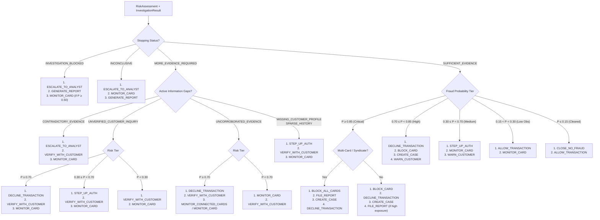

# FraudGraph AI — Stage 4: Next Best Action (NBA) Engine Specification & Verification Report

**Workstream:** Person 1 — Brain (Investigation Orchestration & Decisioning)  
**Stage:** Stage 4 — Next Best Action Engine  
**Status:** COMPLETE & VERIFIED  
**Date:** September 2026  
**Test Baseline:** Stage 1 = 35 tests, Stage 2 = 21 tests, Stage 3 = 29 tests, Stage 4 = 30 tests. **Total: 115 passing tests (0 failures, 0 errors)**.

---

## 1. Executive Summary & Core Objective

Stage 4 of Person 1's workstream implements the **Next Best Action (NBA) Engine** for FraudGraph AI.
The NBA Engine answers the single, fundamental operational question:

> **"WHAT SHOULD THE INVESTIGATION DO NEXT, BASED ON THE CURRENT EVIDENCE AND RISK?"**

It transforms Stage 2's evidence baseline (`InvestigationResult`) and Stage 3's evidentiary risk evaluation (`RiskAssessment`) into an ordered, prioritized, explainable sequence of canonical remediation, validation, and surveillance actions.

### Strict Stage 4 Architectural Boundaries
- **Outputs ONLY the 14 Canonical Actions:** Enforces the organizer's exact 14 action names. Legacy or ad-hoc actions are strictly rejected or normalized.
- **Purely Evidentiary & Deterministic:** NBA reasoning is zero-cost, purely deterministic, and grounded in existing structured evidence.
- **Zero Query Overhead:** Zero calls to Person 2 graph query tools (`get_transaction`, `get_customer`, `detect_fraud_patterns`, `retrieve_context`).
- **Zero Action Execution:** Does not mutate cards, accounts, or transactions (belongs to Stage 6 Execution).
- **Zero Policy/Approval Routing:** Does not evaluate compliance rules R1–R10 or route approvals to L1/L2 (belongs to Stage 5 Policy & HITL).
- **Protected Boundaries:** Zero modifications to Person 2 (`tigergraph/`, `graphrag/`, `data/`) and Person 3 (`frontend/`). `Information/` remains completely ignored.

---

## 2. Canonical Action Vocabulary

The Stage 4 NBA Engine strictly restricts all recommendations to the organizer's **14 canonical action types**:

| # | Action Name | Operational Category | Purpose & Description |
|---|---|---|---|
| 1 | `ALLOW_TRANSACTION` | Clearing | Release transaction for standard settlement. |
| 2 | `DECLINE_TRANSACTION` | Prevention | Block transaction processing immediately to protect against loss. |
| 3 | `MONITOR_CARD` | Surveillance | Place card on heightened surveillance without immediate restriction. |
| 4 | `MONITOR_CONNECTED_CARDS` | Surveillance | Surveil all linked cards across graph entities for coordinated patterns. |
| 5 | `WARN_CUSTOMER` | Alerting | Send real-time notification/alert to cardholder regarding anomalous activity. |
| 6 | `VERIFY_WITH_CUSTOMER` | Inquiry | Prompt cardholder directly (via SMS/app/call) to confirm transaction legitimacy. |
| 7 | `STEP_UP_AUTH` | Challenge | Challenge transaction with 2FA / OTP step-up authentication. |
| 8 | `BLOCK_CARD` | Containment | Deactivate compromised card to prevent further unauthorized attempts. |
| 9 | `BLOCK_ALL_CARDS` | Containment | Systemically freeze all cards linked to a customer/syndicate entity. |
| 10 | `GENERATE_REPORT` | Technical Audit | Compile audit report documenting evidence, outages, or intermediate state. |
| 11 | `CREATE_CASE` | Workflow | Create formal fraud case in memory/graph for dispute and claims tracking. |
| 12 | `FILE_REPORT` | Regulatory | Prepare and file regulatory Suspicious Activity Report (SAR) with FinCEN. |
| 13 | `ESCALATE_TO_ANALYST` | Human Review | Route case to human fraud specialist due to contradictions or outages. |
| 14 | `CLOSE_NO_FRAUD` | Resolution | Formally close investigation with a cleared/legitimate finding. |

### Legacy Alias Normalization
To prevent breaking legacy callers and tests, `NextBestActionItem` normalizes common operational aliases seamlessly:
- `BLOCK_TRANSACTION` $\to$ `DECLINE_TRANSACTION`
- `FREEZE_ACCOUNT` $\to$ `BLOCK_ALL_CARDS`
- `REQUEST_STEP_UP_AUTH` $\to$ `STEP_UP_AUTH`
- `REQUEST_VERIFICATION` $\to$ `VERIFY_WITH_CUSTOMER`
- `FILE_SAR` $\to$ `FILE_REPORT`
- `MONITOR` $\to$ `MONITOR_CARD`

Any arbitrary string outside these 14 canonical actions (or their aliases) raises a Pydantic `ValidationError`.

---

## 3. Decision Hierarchy & Reasoning Order

The NBA Engine evaluates actions in a strict, deterministic sequence:
$$\text{Current Risk} \longrightarrow \text{Stopping Status} \longrightarrow \text{Information Gaps} \longrightarrow \text{Graph Context} \longrightarrow \text{Ranked Actions}$$

### Rule Matrix



---

## 4. Initial vs. Final Recommendations & Explainability

The engine supports dynamic investigation cycles through two distinct evaluation phases:

1. **`evaluate_initial(risk, investigation)`**:
   Computes initial recommendations prior to interactive validation steps.
2. **`evaluate_final(risk, investigation, initial_actions, initial_risk, evidence_added)`**:
   Computes final recommendations following additional evidence integration, and generates a structured `NBAWhatChanged` explainability payload.

### `NBAWhatChanged` Model
```python
class NBAWhatChanged(BaseModel):
    explanation: str                   # Human-readable narrative of the shift
    before_fraud_probability: float    # Heuristic fraud probability before update
    after_fraud_probability: float     # Heuristic fraud probability after update
    before_uncertainty: float          # Epistemic uncertainty before update
    after_uncertainty: float           # Epistemic uncertainty after update
    resolved_gaps: List[str]           # Information gaps settled by new evidence
    evidence_added: List[str]          # Concrete evidence descriptions added
```

---

## 5. Workflow Integration & API Layer

### Workflow Factory: `create_nba_workflow()`
The Stage 4 workflow terminates cleanly at `NBA_COMPLETE`:
$$\text{TRIGGERED} \to \text{ENRICHMENT} \to \text{GRAPH\_ANALYTICS} \to \text{GRAPHRAG\_CONTEXT} \to \text{EVIDENCE\_PROCESSOR} \to \text{INVESTIGATION\_COMPLETE} \to \text{RISK\_UNCERTAINTY} \to \text{RISK\_ASSESSMENT\_COMPLETE} \to \text{NEXT\_BEST\_ACTION} \to \text{NBA\_COMPLETE}$$

Nodes populate `AgentState`:
- `state["next_best_action_assessment"]`: Complete `NextBestActionAssessment` object.
- `state["next_best_action"]`: Primary action recommendation dictionary.
- `state["initial_next_best_actions"]`: Serialized initial items.
- `state["final_next_best_actions"]`: Serialized final items (if updated).
- `state["what_changed"]`: Textual or structured explainability explanation.

### REST API Endpoints
- `POST /api/investigations/{transaction_id}/nba` (Canonical)
- `POST /api/investigate/{transaction_id}/nba` (Alias)

Both return `NextBestActionAssessment` with HTTP 200 OK.

---

## 6. Verification & Test Suite Summary

### Test Results
All **115 automated unit tests** across all 4 stages pass cleanly in **0.200 seconds**:

```
..................................Workflow loop limit exceeded: 6 > 5
...............GraphRAG retrieval failed for TXN-104829: GraphRAG service timeout
..................................................................
----------------------------------------------------------------------
Ran 115 tests in 0.200s

OK
```

### Breakdown by Stage
- **Stage 1 (Foundation):** 35 passed, 0 failed
- **Stage 2 (Investigation Engine):** 21 passed, 0 failed
- **Stage 3 (Risk & Uncertainty):** 29 passed, 0 failed
- **Stage 4 (Next Best Action):** 30 passed, 0 failed
- **Total Passing Tests:** **115 passed, 0 failed, 0 errors**

### Stage 4 Test Categories
1. **Vocabulary Tests:** Canonical action set validation, Pydantic item validation, legacy alias normalization, non-canonical action rejection.
2. **Deterministic NBA Rule Tests:** Blocked state escalation, inconclusive state monitoring, contradictory evidence escalation, unverified customer challenge/decline, uncorroborated evidence handling, sparse profile step-up, critical multi-card syndicate freezing, single-card compromise blocking, elevated risk decline, low-risk cleared closure, low-risk observation.
3. **Priority & Monotonicity:** Strictly increasing priority order (1..N) without action duplication.
4. **Service & Explainability:** Initial evaluation, final evaluation with evidence shift, `NBAWhatChanged` derivation, Markdown summary formatting, `NextBestActionEngineInterface` compliance.
5. **Strict Boundary Tests:** Mock-asserting ZERO calls to `get_transaction`, `get_customer`, `detect_fraud_patterns`, `retrieve_context`, or `execute_action`.
6. **Workflow Integration:** Running `create_nba_workflow()` to `NBA_COMPLETE`, validating timeline events and state fields.
7. **REST API Endpoints:** Calling `POST /api/investigations/{transaction_id}/nba` with and without initial actions.
8. **Real Seeded Data Smoke Tests:** Verifying `TXN-104829` (high risk) and `TXN-209144` (benign) produce valid, policy-consistent canonical actions without hardcoding answer keys.

---

## 7. Next Stage Readiness

With Stage 4 fully implemented and verified, the repository is ready for **Stage 5: Policy Compliance & Human-in-the-Loop (HITL) Gate**:
- Evaluation of compliance clauses R1–R10.
- Governance approval thresholds and hierarchy determination (Auto vs. L1 Supervisor vs. L2 Compliance Officer).
- Binding the HITL Gate to hold high-risk or policy-restricted actions for human authorization.
